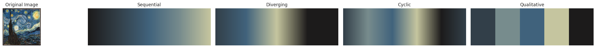

# palettecleanser
`palettecleanser` is a python library for quick conversions of images to custom color maps

[](https://www.gnu.org/licenses/gpl-3.0)
---
## Installation
(TODO)

## Quickstart
To convert an image to a custom color map, simply select an image and load it into `palettecleanser` as a `CMap` object, where desired attributes such as the number of colors can be specified as part of the class initialization. All avaiable colormaps for the image can be displayed via. the `display_all_cmaps` method.
```py
import palettecleanser as pc
vangogh = pc.CMap('images/vangogh.jpg')
vangogh.display_all_cmaps()
```




Specific colormaps ((sequential, qualitative, etc) are stored as attributes for this object and are compatible with `matplotlib`, `seaborn`, and `plotly`.
```py
# sequential colormap in matplotlib
plt.scatter(x, y, c=colors, cmap=vangogh.sequential)

# qualitative colormap in matplotlib
plt.bar(categories, values, color=vangogh.qualitative)

# qualitative colormap in seaborn
sns.swarmplot(df, x="x", y="y", hue="z", palette=vg.qualitative)

# generic colormap in plotly
px.scatter(df, x="x", y="y", color="z", color_continuous_scale=vangogh.plotly)

```
See `usage.ipynb` for more examples.

## Examples
### Vangogh - Starry Night


### Hokusai - The Great Wave off Kanagawa


### Red Rose


### Sunset


More examples available in `usage.ipynb`.

## Contributing
(TODO)
## Meta
Jiaming Chen –  jiaming.justin.chen@gmail.com

Distributed under the GPL 3 (or any later version) license. See ``LICENSE`` for more information.

[https://github.com/sansona/palettecleanser](https://github.com/sansona/)