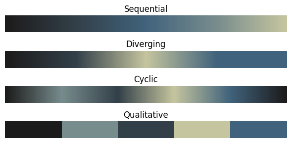
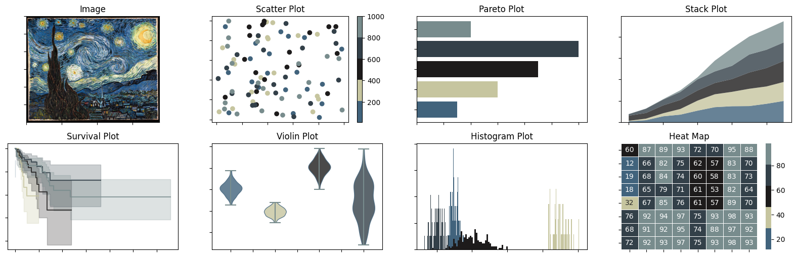
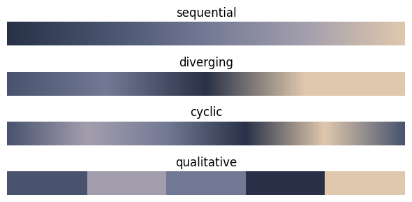
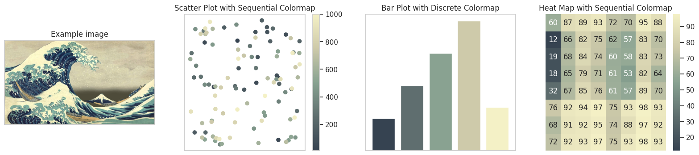
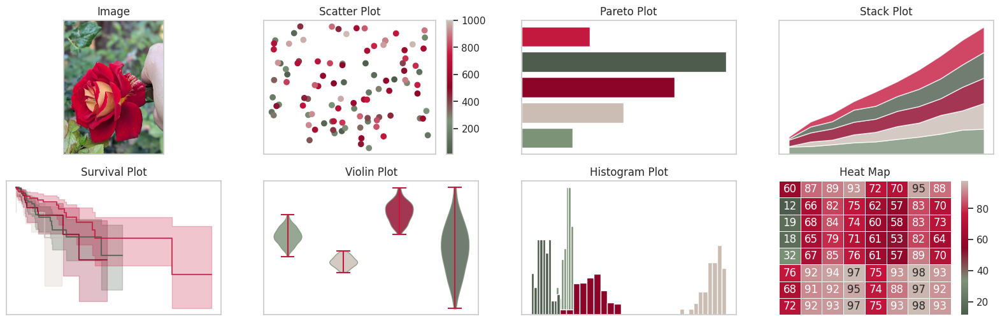
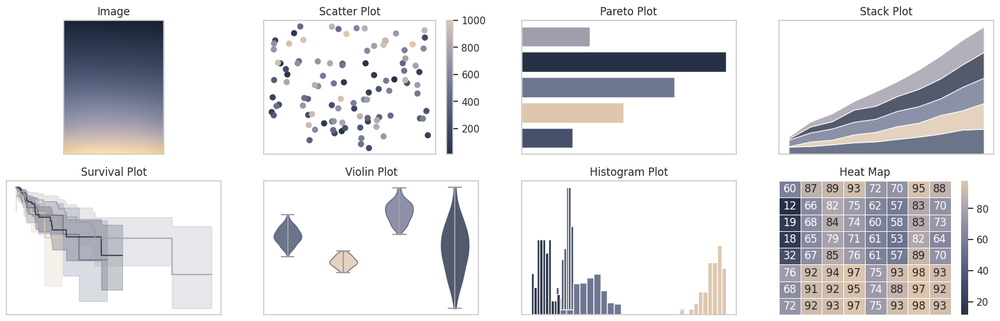

# palettecleanser
`palettecleanser` is a python library for quick conversions of images to custom color palettes

[](https://www.gnu.org/licenses/gpl-3.0)
---
## Installation
(TODO)

## Quickstart
To convert an image to a custom color palette, simply select an image and load it into `palettecleanser` as a `Palette` object, where desired attributes such as the number of colors (`n_colors`) can be specified as part of the class initialization. All available palettes for the image can be displayed via. the `display_all_palettes` method.
```py
from palettecleanser.palettes import Palette

# load image
vangogh = Palette('images/vangogh.jpg')
vangogh.display_all_palettes()
```




Specific palette types (sequential, qualitative, etc) are stored as attributes for this object and are compatible with `matplotlib`, `seaborn`, and `plotly`.
```py
# sequential palette in matplotlib
plt.scatter(x, y, c=colors, palette=vangogh.sequential)

# qualitative palette in matplotlib
plt.bar(categories, values, color=vangogh.qualitative)

# qualitative palette in seaborn
sns.swarmplot(df, x="x", y="y", hue="z", palette=vangogh.qualitative)

# generic palette in plotly
px.scatter(df, x="x", y="y", color="z", color_continuous_scale=vangogh.plotly)
```
To get a sense for how well your palette works, use the `display_example_plots` method
```py
# this creates some misc plots using your generated palettes
vangogh.display_example_plots()
```


`palettecleanser` also comes prepackaged with some custom palettes:
```py
from palettecleanser import custom

custom.TwilightSunset.display_all_palettes()
```


See `usage.ipynb` for more examples.

## Examples
### Hokusai - The Great Wave off Kanagawa


### Red Rose


### Sunset


More examples available in `usage.ipynb`.

## Contributing
Contributions at all levels are welcome! I'm happy to discuss with anyone the potential for contributions. Please see `CONTRIBUTING.md` for some general guidelines and message me with any questions!

## Meta
Jiaming Chen –  jiaming.justin.chen@gmail.com

Distributed under the GPL 3 (or any later version) license. See ``LICENSE`` for more information.

[https://github.com/sansona/palettecleanser](https://github.com/sansona/)