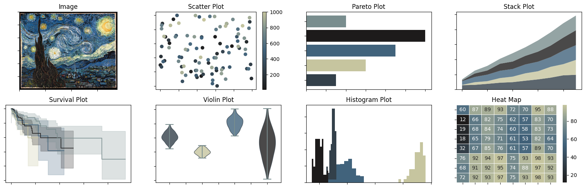
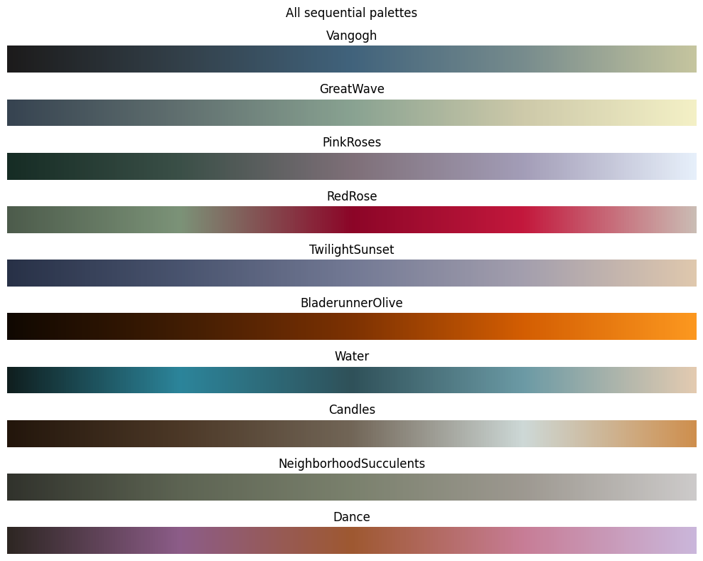
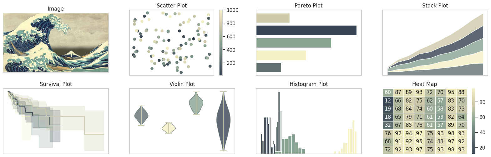
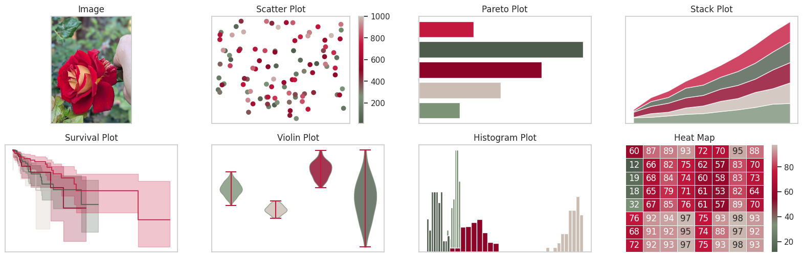
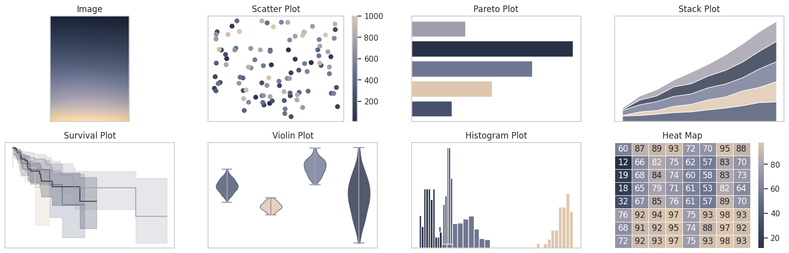
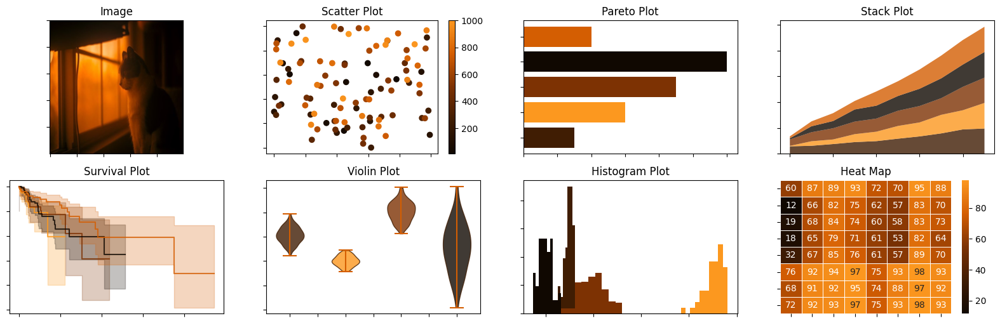

# palettecleanse
`palettecleanse` is a python library for quick conversions of images to custom color palettes

 [](https://opensource.org/licenses/MIT)
 
## Installation
```pip import palettecleanse```

For manually installing requirements:
``` pip install -r requirements.txt```

To verify the installation worked, run the following code:
```py
from palettecleanse.presets import TwilightSunset

TwilightSunset.display_plotly_examples()
```

## Quickstart
To convert an image to a custom color palette, simply select an image and load it into `palettecleanse` as a `Palette` object, where desired attributes such as the number of colors (`n_colors`) can be specified as part of the class initialization. All available palettes for the image can be displayed via. the `display_all_palettes` method.
```py
from palettecleanse.palettes import Palette

# load image
vangogh = Palette('images/vangogh.jpg')
vangogh.display_all_palettes()
```


Specific palette types (sequential, qualitative, etc) are stored as attributes for this object and are compatible with `matplotlib`, `seaborn`, and `plotly`.
```py
# sequential palette in matplotlib
plt.scatter(x, y, c=colors, palette=vangogh.sequential)

# qualitative palette in matplotlib
plt.bar(categories, values, color=vangogh.qualitative)

# qualitative palette in seaborn
sns.swarmplot(df, x="x", y="y", hue="z", palette=vangogh.qualitative)

# generic palette in plotly
px.scatter(df, x="x", y="y", color="z", color_continuous_scale=vangogh.plotly)
```
To get a sense for how well your palette works, use the `display_example_plots` method
```py
# this creates some misc plots using your generated palettes
vangogh.display_example_plots()

# plotly equivalent
vangogh.display_plotly_examples()
```


`palettecleanse` also comes prepackaged with some preset palettes:
```py
from palettecleanse.presets import TwilightSunset

TwilightSunset.display_all_palettes()
```


See `usage.ipynb` for more examples.

## Examples
All available preset palettes can be accessed via. the `display_all_preset_palettes` method
```py
display_all_preset_palettes('sequential')
```


Below are example plots made using via. the `display_example_plots` method that can be used to get a bird's eye view on how well a palette behaves across generic plot types
### Hokusai - The Great Wave off Kanagawa


### Red Rose


### Sunset


### Bladerunner Olive


More examples available in `usage.ipynb`.

## Contributing
Contributions at all levels are welcome! I'm happy to discuss with anyone the potential for contributions. Please see `CONTRIBUTING.md` for some general guidelines and message me with any questions!

## Meta
Jiaming Chen –  jiaming.justin.chen@gmail.com

Distributed under the MIT license. See ``LICENSE.txt`` for more information.

[https://github.com/sansona/palettecleanse](https://github.com/sansona/)
